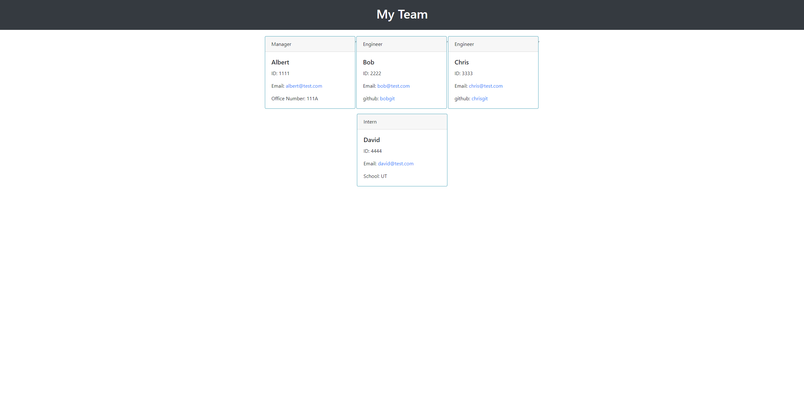

# team-profile-generator
  

  ## Table of Contents

  * [Installation](#installation)
  * [Usage](#usage)
  * [Contributing](#contributing)
  * [Tests](#tests)
  * [License](#license)
  * [Questions](#questions)

  ## Description
  This application generates a website to access employee info such as email, id, github, etc. 

  ## Installation
  install necessary packages using "npm install" then run code using "node index.js"

  ## Usage
  Creates website with detailed information about team members. Each employee card has relevant information and links to their github account or email address.
  
  

  [Walkthrough Video](https://drive.google.com/file/d/1PXv7ReWwKbPuo3MdPUYnUuZNFbNq2kmR/view)
  
  ## Contributing
  made by me

  ## Tests
  testing is done via jest
  run tests using "npm run test"

  ## License
  Licensed under the MIT license

  ## Questions? 
  [Github](https://www.github.com/jochsf)
